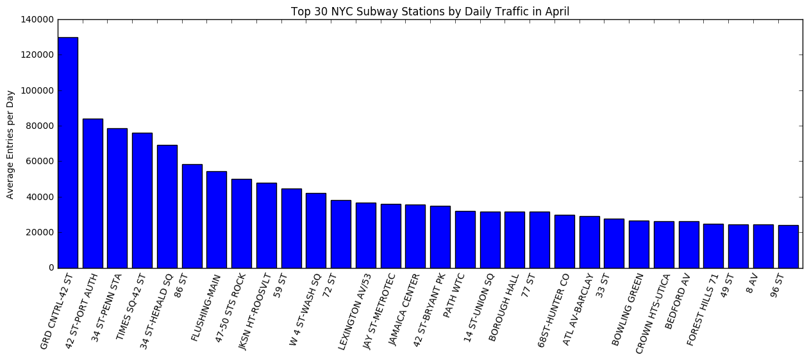

# Open-ended Project MVP

Recommendation for best NYC subway stations to canvass to raise awareness
about women in tech.

### Initial Data Cleaning Approach and Exploratory Findings
First, I analyzed the NYC subway turnstile dataset available on the
[MTA website](http://web.mta.info/developers/turnstile.html).
Each data file consists of a week's worth of hourly entry and exit
turnstile counts,  organized by subway line and station.

I assumed that the canvassing campaign will occur in April 2017, so the
initial examination focused on four weeks of subway entry counts from April
2016, in order to account for the effects of seasonality.

Next, I segmented the turnstile entry counts by station to calculate the average
daily entries for each station. The top 30 most trafficked stations are
shown below:

### Initial Research Findings

1. **Family Attitudes** - A social science study found that the most
influential factor in a child's decision to pursue a career in STEM was parental
encouragement (Rodrigues et al. 2011). Therefore, canvassing areas with a higher
proportion of families with children would be an effective strategy to
engage parents on issues surrounding gender and STEM professions, thereby
increasing the number of women in tech.

2. **Economic Inequality and Political Participation** - In researching
strategies for canvassing strangers, I came across an interesting research
paper that showed that the level of economic inequality in an individual's
community can be correlated with the frequency with which residents choose to
engage in socially-based political activities, such as voting, discussing
politics, and signing a petition. I choose to focus on the behavior of signing a
petition in person, which would most closely relate to the experience of
canvassing.

...While low-income individuals are equally likely to sign a petition regardless
of neighborhood income levels, the number of high-status individuals who signed
petitions in-person increased by 13% when going from areas with a low to high
level of contrast in income level. In addition, there was a 7% increase for low
income individuals and a 13% increase for high income individuals when signing
a petition face-to-face instead of online.

...Targeting subway stops in neighborhoods that have a high degree of economic
inequality may be one way to increase responsiveness to canvassing.

3. **Number of Targeted Stations** - Using the National Center for Women and
Information Technology as an example, about $10,000 of the budget
was directed toward fundraising efforts (obtained from 
[guidestar.org](https://www2.guidestar.org/profile/68-0591481). Therefore, canvassing should
realistically not exceed a total budget of $10,000.
Assuming a canvasser would be paid at $15/hour and that canvassers would be
dispatched in pairs (a common practice), the campaign could cover 8 stations
for one week working M-F, 8 hours a day.

### Further Research and Analysis

1. Search for open data about family demographics in NYC.
2. Search for open data about income inequality for subway stations in NYC.
3. Match areas with high proportions of / larger families and higher degress
of income inequality with subway stations.

### Sources

Rodrigues, S., Jindal-Snape, D., & Snape, J.B. (2011). Factors that influence
student pursuit of science careers;
the role of gender, ethnicity, family and friends. Science Education
International, 22 (4) (December 2011), 266-273.

Szewczyk, J. (2015). The Effects of Income Inequality on Political Participation:
A Contextual Analysis. Sewanee University. 25-33.
