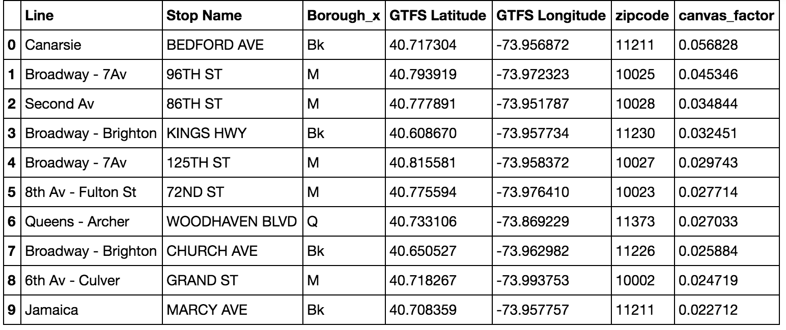
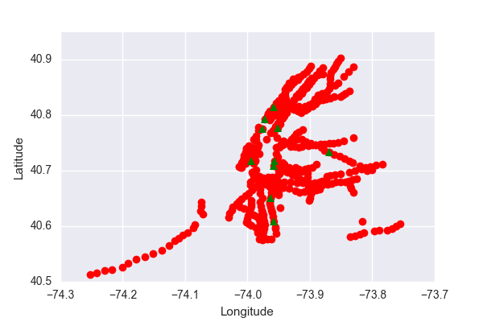

# NYCSubwayCanvas

Recommendation for best NYC subway stations to canvass to raise awareness
about women in tech.

## Goals

A non-profit organization is trying to raise awareness about
women in technology. We need to identify the best areas to canvas.
The organization will be placing street teams at the entrances
to various subway stations.

## Assumptions

My assumptions are described in more detail in the [NYC Subway MVP](https://github.com/kevinchowder/NYCSubwayCanvas/blob/master/NYC%20Subway_MVP.md)

1) **Family Attitudes Influence Career Choice** - A social science study
found that the most influential factor in a child's decision to pursue a
career in STEM was parental encouragement (Rodrigues et al. 2011).
Therefore, I assume that canvassing areas with a higher
proportion of families with children would be an effective strategy to
engage parents on issues surrounding gender and STEM professions, thereby
increasing the number of women in tech.

2) **Economic Diversity Affects Political Participation** - In researching
strategies for canvassing strangers, I came across an interesting research
paper that showed that the level of economic inequality in an individual's
community can be correlated with the frequency with which residents choose to
engage in socially-based political activities, such as voting, discussing
politics, and signing a petition. I assume that targeting subway stops in
neighborhoods that have a high degree of economic
diversity may be one way to increase responsiveness to canvassing, since
people are likely to be more receptive to socially-based political activities.

3) **Number of Targeted Stations** - Using the National Center for Women and
Information Technology as an example, about $10,000 of the budget
was directed toward fundraising efforts (obtained from 
[guidestar.org](https://www2.guidestar.org/profile/68-0591481).  
As a result, I assume that canvassing should
realistically not exceed a total budget of $10,000. Assuming a canvasser would
be paid at $15/hour and that canvassers would be
dispatched in pairs (a common practice), the campaign could cover 8 stations
for one week working M-F, 8 hours a day.

## Approach

1) **Family Attitudes Influence Career Choice** - I found a dataset from
the U.S. Census bureau  - American Community Survey 5-year estimates
that gives the number of children under 18 years old by zip code and normalized
based on the max and min of this dataset.

2) **Economic Diversity Affects Political Participation** - I found
another dataset from the U.S. Census bureau - American Community Survey
5-year estimates that gives the Gini coefficient by zip code.

3) **Finding Station Zipcode** - I linked the household children data and the list of Gini coefficients
by bringing in two more datasets -
one contains a list of zip codes and their longitude/latitude coordinates,
while the other contains the list of all NYC subway stations and their
geographic coordinates. Using the Haversine formula, I computed the shorted distance between
each station and the set of each zip code coordinates. I then assigned
the zip code of the minimum distance to each station. Using this zipcode, I was
able to merge the dataframes from 1) and 2).

4) **Station Ridership** - I had originally found the station ridership
by analyzing the turnstile data provided on the MTA website (detailed in this
notebook), but the turnstiles were identified using station name strings, which
are not unique. For instance, there is an 86th St station in Manhattan,
but there is also one in Brooklyn as well. Instead, I used the data found on the 
[MTA website](http://web.mta.info/nyct/facts/ridership/ridership_sub.htm)
which lists weekday ridership by borough and by station, which will reduce station
redundancy and provide a more accurate description of station traffic.
One [reddit user](https://www.reddit.com/r/nyc/comments/3fmju2/annual_subway_ridership_in_nyc_by_station/) 
cleaned this data, which made it easy to use:

## Cleaning the Data & Finding Target Stations

This notebook details the process of cleaning the data and finding target
stations -
  
I normalized station ridership data based on the minimum and maximum traffic,
multiplied by the number of children under 18 in households (also normalized
by the max and min of the dataset), and multiplied this by the Gini
coefficient in order to obtain a canvassing factor for each station.

Notably, there were several stations that did not have Gini coefficients or
estimates for children in households, so these stations were taken out of
the consideration set.

Additionally, in order to match the Gini coefficient and children in household
data with station ridership data using the stop name, which was not unique, I
split up the ridership data by borough. For stations with the same name
within each borough (just a few examples in each), I then sorted the data and
removed duplicates, in order to consider just the stations with high ridership
counts as canvassing candidates. I also used Gabriel's station name cleaning method to match station data with
ridership data.

## Final Recommendations

### Station List

The stations chosen for canvassing are shown in the table above and represented
using their geographic coordinates below. The locations are spread out in
Brooklyn, Manhattan, and Queens. It is interesting that there are two
locations on the Broadway - 7 Ave line, and two locations on the Broadway -
Brighton Line as well.

## Lessons Learned

I learned to try to think ahead when I know
I will have to eventually join the data using a certain unique identifier.

I also learned that I need to constantly be checking and verifying the data
as I go along. After each step, I have to verify to myself - does the data
make sense? Am I cleaning out entries or selecting data points that should
not be chosen?

## Further Analysis

1. Time - The data only considered weekday subway ridership - what about
traffic on weekends, or certain times of day?

2. Other Factors - The analysis only took into account the # of children in
households and economic inequality. It would be interesting to include other
drivers of political engagement (education level, income, etc.) as well
as other demographics (young female students) that may represent populations
that would be receptive to canvassing efforts about women in tech.

3. Metric for success - It would be interesting to attempt to measure
or quantify success in the realm of canvassing. How do non-profits actually
go about setting quotas or evaluate the effect of canvassing campaigns?

## Code Information

The [Subway Data Cleaning notebook](Subway Canvassing Data Cleaning.ipynb) explains the process for obtaining the
final recommendation list.

### Sources

Gabrielcs High Schools dataset cleaning and exploration Notebook
https://github.com/gabrielcs/nyc-subway-canvass/blob/master/high-schools-cleaning-exploration.ipynb

List of zip codes and longitude/latitude coordinates
https://www.gaslampmedia.com/download-zip-code-latitude-longitude-city-state-county-csv/

National Center for Women and Information Technology
https://www2.guidestar.org/profile/68-0591481

NYC Station Ridership
https://www.reddit.com/r/nyc/comments/3fmju2/annual_subway_ridership_in_nyc_by_station/

Rodrigues, S., Jindal-Snape, D., & Snape, J.B. (2011). Factors that influence
student pursuit of science careers;
the role of gender, ethnicity, family and friends. Science Education
International, 22 (4) (December 2011), 266-273.

Szewczyk, J. (2015). The Effects of Income Inequality on Political Participation:
A Contextual Analysis. Sewanee University. 25-33.

U.S. Census Bureau (2015).
Gini Index of Income Inequality American Community Survey 1-year estimates.

U.S. Census Bureau (2011-2015). Household Type for Children Under 18 Years in
Households (Excluding Householders, Spouses, and Unmarried Partners)
American Community Survey 5-year estimates.
